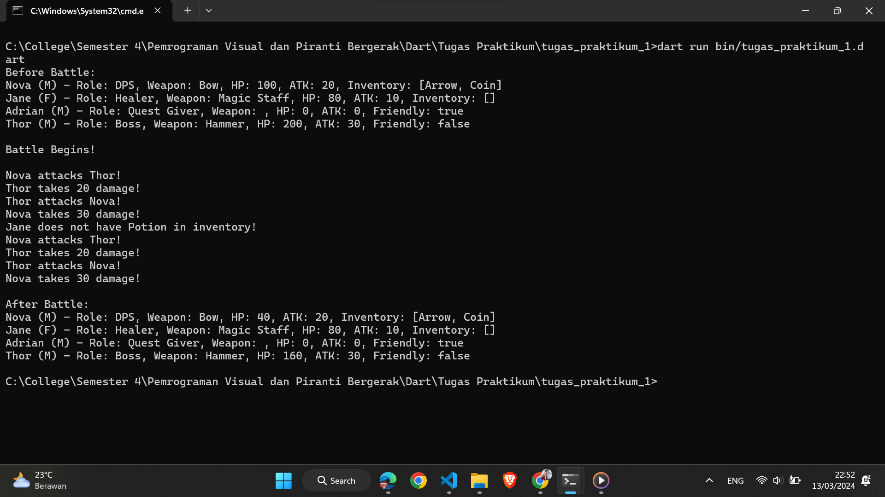

# Tugas Praktikum 1 Provis 2024

## Janji

Saya Themy Sabri Syuhada dengan NIM 2203903.
Demi keberkahan-Nya, saya berjanji mengerjakan
tugas praktikum 1 DPBO dengan jujur dan tidak melakukan kecurangan seperti yang telah dispesifikasikan.
Aamiin.

## Deskripsi

Program ini adalah sistem manajemen karakter untuk sebuah permainan. Dalam permainan tersebut, pemain dapat mengendalikan karakter, berinteraksi dengan karakter non-pemain (NPC), dan bertarung melawan musuh. Setiap karakter memiliki atribut seperti nama, jenis kelamin, senjata, peran, dan statistik seperti HP (Health Points) dan ATK (Attack Points). Pemain dapat mengumpulkan dan menggunakan berbagai item yang tersedia dalam permainan.

## Implementasi OOP dan Asynchronous

Implementasi OOP (Object-Oriented Programming) dalam program tersebut terdiri dari beberapa aspek:

1. **Pewarisan (Inheritance)**: Kelas 'Player', 'NPC', dan 'Enemy' adalah turunan dari kelas 'Character'. Ini memungkinkan kelas-kelas tersebut untuk mewarisi atribut dan metode dari kelas 'Character', sehingga tidak perlu mengulang definisi atribut dan metode yang sama.

2. **Komposisi (Composition)**: Kelas 'Player' memiliki atribut 'Inventory', yang merupakan objek dari kelas 'Inventory'. Ini adalah contoh dari komposisi, di mana satu kelas ('Player') memiliki objek dari kelas lain ('Inventory') sebagai salah satu atributnya.

3. **Polimorfisme**: Metode 'attack()' yang ada dalam kelas 'Character' diimplementasikan ulang (override) di kelas 'Enemy' untuk menangani kasus spesifik ketika musuh menyerang. Hal ini menunjukkan polimorfisme, di mana metode yang sama dapat berperilaku berbeda tergantung pada objek yang memanggilnya.

4. **Abstraksi**: Kelas 'Character', 'Player', 'NPC', dan 'Enemy' mewakili abstraksi dari karakter-karakter yang ada dalam permainan dengan menyediakan atribut dan metode yang sesuai dengan karakteristik masing-masing.

5. **Encapsulation**: Setiap kelas mengelola data dan perilaku yang terkait dengannya, dan menyembunyikan detail implementasi dari kelas lain. Misalnya, kelas 'Player' menyembunyikan implementasi dari inventarisnya dalam kelas 'Inventory'.

Implementasi asynchronous function terjadi pada metode 'attack()' dan 'useItem()' yang menggunakan kata kunci 'async' dan 'await'. Ketika karakter menyerang atau menggunakan item, operasi tersebut mungkin memerlukan waktu yang signifikan (seperti mengirim permintaan jaringan atau berinteraksi dengan sistem file). Dengan menggunakan asynchronous function, program dapat melanjutkan menjalankan tugas-tugas lain tanpa harus menunggu operasi yang memerlukan waktu selesai terlebih dahulu. Ini memungkinkan program untuk tetap responsif dan tidak terblokir saat menunggu operasi yang memerlukan waktu.

## Penjelasan Alur Program

1. Program dimulai dengan inisialisasi karakter pemain (Player) dan karakter non-pemain (NPC dan Enemy).
2. Setiap karakter diberikan atribut seperti nama, jenis kelamin, senjata, peran, HP, dan ATK.
3. Karakter pemain diberikan item-item dalam inventarisnya menggunakan metode addToInventory.
4. Karakter pemain dapat menggunakan item dari inventarisnya menggunakan metode useItem.
5. Pemain dapat menyerang karakter lain menggunakan metode attack.
6. Karakter non-pemain dapat berinteraksi dengan pemain, misalnya memberikan misi atau bertarung.
7. Program menampilkan pesan berdasarkan aksi yang dilakukan oleh pemain dan karakter lainnya.

## Screenshots

